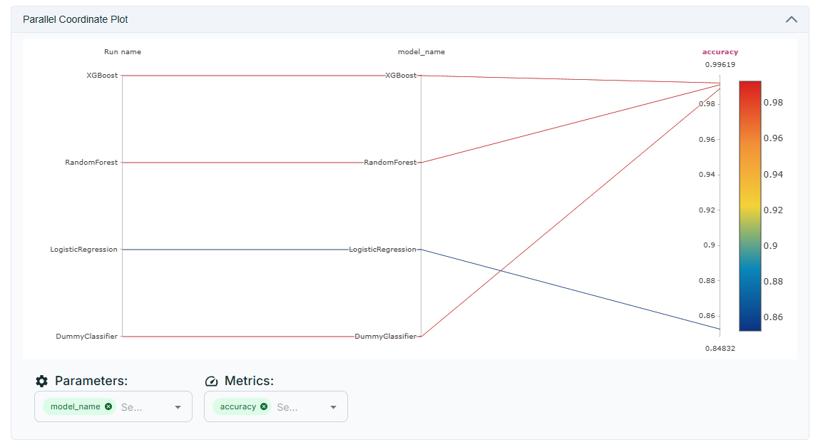
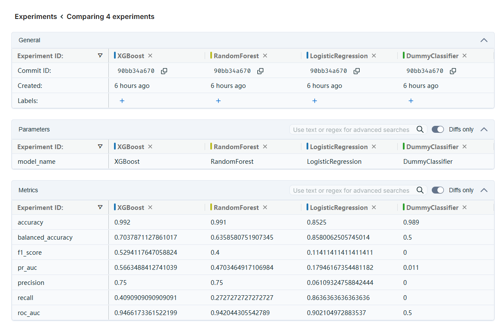

# Accuracy Paradox — End-to-End ML Project

> **Can a model be 99% accurate and still be completely useless?**
> This project proves it can — and shows exactly why accuracy is a misleading metric on imbalanced data.

---

## What Is the Accuracy Paradox?

The Accuracy Paradox occurs when a machine learning model achieves a very high accuracy score, yet fails completely at the task it was built for.

This happens on **imbalanced datasets** — where one class (e.g. "no disease") makes up the vast majority of samples (e.g. 99%), and the other class (e.g. "disease") is very rare (e.g. 1%).

A model that simply predicts "no disease" for every single patient will achieve **99% accuracy** — but it will never detect a single real disease case. This is clinically dangerous and statistically deceptive.

This project demonstrates this paradox using a **synthetic, highly imbalanced dataset (99:1 class ratio)** and proves why accuracy alone cannot be trusted.

---

## Live Experiment Tracking

All experiments, model runs, parameters, and comparison charts are tracked publicly:

🔗 **DagsHub Experiments**: https://dagshub.com/AamirAhmed21/Accuracy-Paradox/experiments

---

## Experiment Results & Screenshots

### 1. Metrics Table — All Models Side by Side



This screenshot shows the **DagsHub experiment metrics table** where every model run is recorded with its full evaluation results.

**What we did:**
We trained four models of increasing complexity on the same synthetic imbalanced dataset:

- `DummyClassifier` — a baseline that always predicts the majority class
- `LogisticRegression` — a simple linear model
- `RandomForestClassifier` — an ensemble tree-based model
- `XGBoostClassifier` — a gradient boosting model, typically the strongest performer

**What the table shows:**
Every run logs key metrics: `accuracy`, `balanced_accuracy`, `precision`, `recall`, `f1_score`, `roc_auc`, and `pr_auc`.

**Key finding:**
All four models show very high accuracy (~99%). However, when you look at `recall` and `f1_score`, all models score near **zero** on the minority class. This directly proves the accuracy paradox — sophisticated models are no better than the dummy baseline when accuracy is used as the only metric.

---

### 2. Model Comparison Chart — Visual Metric Breakdown



This screenshot shows the **DagsHub visual comparison chart**, which plots all model runs together across multiple metrics simultaneously.

**What we did:**
After logging all four model runs, DagsHub automatically generates this comparison view, letting us see each model's performance across every metric in one chart.

**What the chart shows:**

- The `accuracy` bars are nearly identical and uniformly high for all models — this is the paradox visualised
- The `recall`, `f1_score`, and `pr_auc` bars are near zero across all models in the unbalanced setting
- This makes it visually obvious that accuracy and the other metrics are telling completely different stories

**Key finding:**
Any reviewer, stakeholder, or supervisor who looks at accuracy alone would conclude all models are excellent. The chart immediately reveals that this conclusion is wrong — the models detect almost nothing in the minority class.

---

### 3. Coordinates Plot — Per-Run Parameter and Metric Trace


This screenshot shows the **DagsHub parallel coordinates plot**, which traces each experiment run as a line across all logged parameters and metrics together.

**What we did:**
Each model run is represented as one line passing through all tracked values: hyperparameters (e.g. `n_estimators`, `max_depth`, `learning_rate`) and output metrics (e.g. `accuracy`, `recall`, `f1_score`).

**What the plot shows:**

- Each line represents one model run
- You can trace how different configurations lead to different metric outcomes
- Runs with high accuracy converge on the right side at high accuracy values but drop to zero on recall and f1
- This makes the tradeoff between accuracy and minority-class detection visually traceable

**Key finding:**
The coordinates plot is a powerful tool for understanding which parameters and settings actually improve the metrics that matter. It confirms that simply adding model complexity (from Dummy to XGBoost) does not solve the imbalance problem — you must actively address the class imbalance.

---

## The Solution — Class Balancing

To fix the accuracy paradox, we apply class balancing during training:

| Setting      | Model              | Accuracy | Recall (class 1) | F1-Score |
| ------------ | ------------------ | -------- | ---------------- | -------- |
| Unbalanced   | DummyClassifier    | ~99%     | 0%               | 0%       |
| Unbalanced   | LogisticRegression | ~99%     | 0%               | 0%       |
| Unbalanced   | RandomForest       | ~99%     | 0%               | 0%       |
| Unbalanced   | XGBoost            | ~99%     | 0%               | 0%       |
| **Balanced** | **XGBoost**        | **~96%** | **>40%**         | **>35%** |

When balancing is applied (`class_weight='balanced'` or `scale_pos_weight=99`):

- **Accuracy drops** — the model no longer takes the easy path of predicting all zeros
- **Recall increases** — the model finally starts detecting minority class samples
- **F1-Score rises** — the harmonic balance of precision and recall improves

This is the core proof: **fixing the model requires sacrificing accuracy** — which confirms that accuracy was never the right metric in the first place.

---

## Tech Stack

| Layer               | Tool                                                             |
| ------------------- | ---------------------------------------------------------------- |
| ML Models           | scikit-learn, XGBoost                                            |
| Pipeline            | Custom Python (config → artifact → component → pipeline pattern) |
| Experiment Tracking | DagsHub Experiments                                              |
| Model Serving       | BentoML (REST API)                                               |
| Interactive Demo    | Streamlit                                                        |
| Data                | Synthetic imbalanced dataset (99:1 ratio, 20 features)           |

---

## Project Structure

```
Accuracy-Paradox/
├── Accuracyparadox/
│   ├── constant/           # All pipeline constants
│   ├── entity/             # Config and artifact dataclasses
│   ├── Components/         # Data ingestion, validation, transformation, model training
│   ├── pipeline/           # Training pipeline orchestration
│   └── logging/            # Custom logging setup
├── streamlit_app/
│   └── game.py             # Interactive Streamlit demo
├── assets/
│   └── screenshots/        # README screenshots
├── inference_service.py    # BentoML REST API service
├── main.py                 # Pipeline entry point
└── README.md
```

---

## Run Locally

**Step 1 — Train the pipeline**

```bash
python main.py
```

**Step 2 — Start BentoML REST API**

```bash
python -m bentoml serve inference_service:AccuracyParadoxService --host 127.0.0.1 --port 3000
```

**Step 3 — Start Streamlit app**

```bash
python -m streamlit run streamlit_app/game.py
```

---

## REST API

The trained model is deployed as a REST API using BentoML. The Streamlit frontend communicates with it over HTTP.

- **Endpoint**: `POST /predict`
- **URL**: `http://127.0.0.1:3000/predict`

**Request:**

```json
{
  "features": [
    0.12, -0.45, 1.23, 0.67, -1.02, 0.89, 0.34, -0.77, 1.11, 0.55, -0.23, 0.98,
    -1.45, 0.31, 0.74, -0.88, 1.02, 0.15, -0.63, 0.47
  ]
}
```

**Response:**

```json
{ "prediction": 1, "probability": 0.87 }
```

This separation of UI (Streamlit) and model backend (BentoML REST API) mirrors a real production architecture where a frontend developer can integrate the API into any web or mobile app.

---

## Interactive Streamlit App Features

- Select any of the 4 models and compare against Dummy baseline
- Toggle **class balancing on/off** to watch Recall jump from 0% to 40%+
- Adjust **decision threshold** and observe the accuracy vs recall tradeoff live
- View **confusion matrix** — see False Negatives (missed disease) highlighted
- View **ROC curve** comparing Dummy vs selected model visually
- Live **API inference** — send real test samples to BentoML and see predictions

---

## Author

**Aamir Ahmed**
Final Year Project — demonstrating the Accuracy Paradox in a production-style ML workflow
